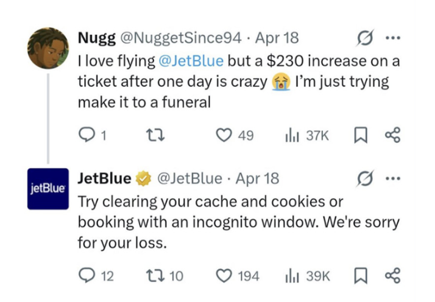
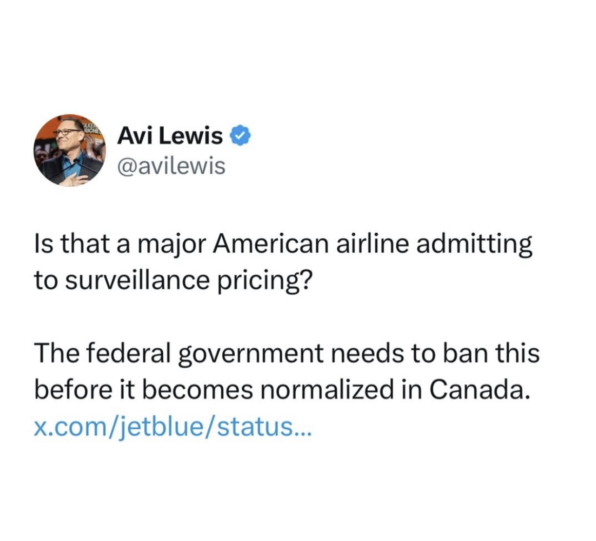
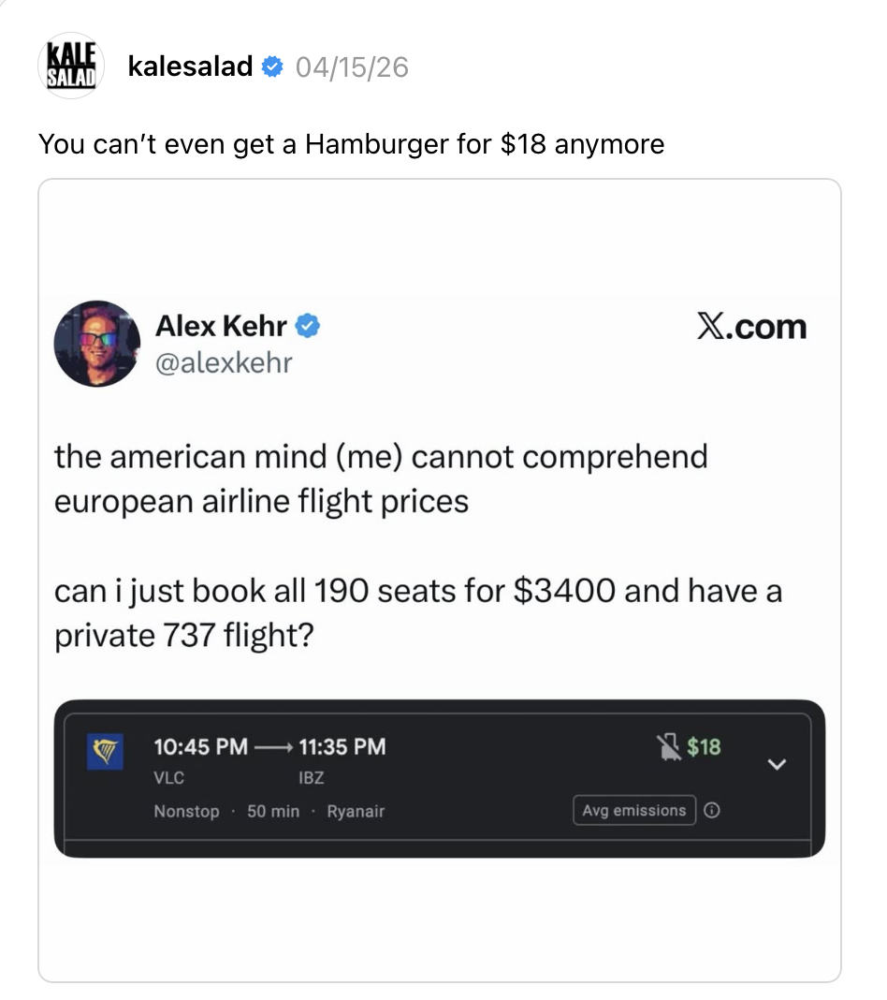
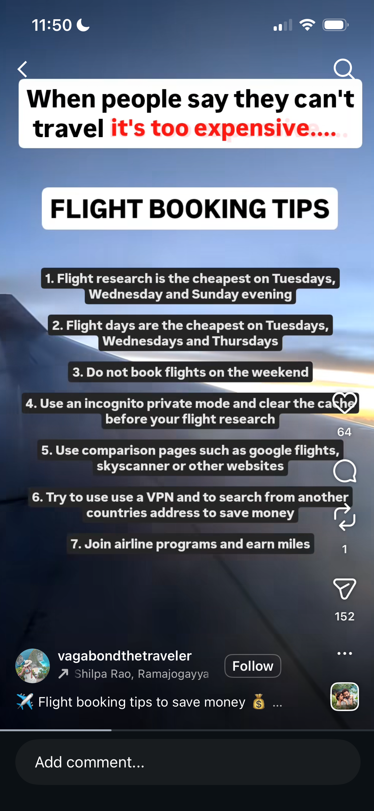
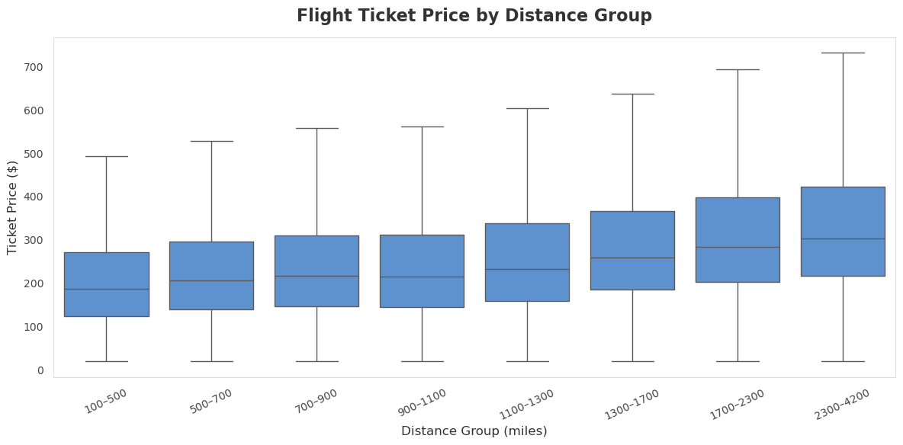
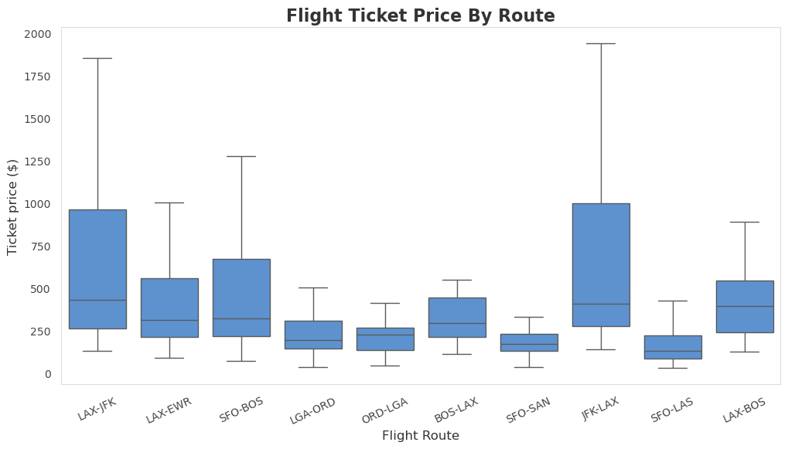

{fig-cap="Deleted JetBlue Tweet. Source: https://x.com/CultureCrave/status/2046631236941295920"}

In a now deleted tweet, JetBlue has, it seems, admitted to surveillance pricing. Surveillance pricing, also known as “personalized algorithmic pricing”, is a tactic used by companies where prices change dynamically based on the data of individual consumers. While federal-level investigations by the Federal Trade Commission into surveillance pricing have approached a standstill, many states have begun cracking down on it. In fact, Maryland is on track to become the first state to ban surveillance pricing for groceries. Yet, surveillance pricing may be true and real for airlines.

:::: {.columns}

::: {.column width="50%"}
{width="100%"} 

<!-- {fig-cap="Deleted Surveillance Pricing Tweet. Source: https://www.instagram.com/p/DXmmV6GDbMx/"} -->
:::

::: {.column width="50%"}
{width="100%"} 

<!-- {fig-cap="Airline Pricing Thread. Source: https://www.threads.com/@kalesalad/post/DXKSVR5jkLt/you-cant-even-get-a-hamburger-for-anymore"} -->
:::

::::

Since the deleted tweet, a lawsuit has been filed against JetBlue for collecting consumer data without consent and using such data to set ticket prices, and others have taken to social media to express their thoughts and frustrations with the airline system in the United States.

Yet buying plane tickets has always been more complicated than simply buying your groceries. Even before this scandal, there still existed tips and tricks on how to ‘game’ the system to get the cheapest airline tickets possible. There exist influencers on social media whose entire brand is built around this. 

{width="25%" fig-align="center"} 

Do flight prices truly vary so randomly? What does the data actually say?

## Flight Fare by Distance and Flight Fare by Route

## What are the most popular flight paths?

<iframe 
  src="images/interactive_viz_1.html"
  width="100%" 
  height="600"
  style="border: none;">
</iframe>

## Interactive Viz 2: (change header)

## Linked View Viz (change header)

## Infographic

## Flight Price & Route Explorer

To view the Flight Price & Route Explorer, click the button below. 

[View Interactive Map](https://5200-data-viz.streamlit.app/){.btn .btn-primary target="_blank"}